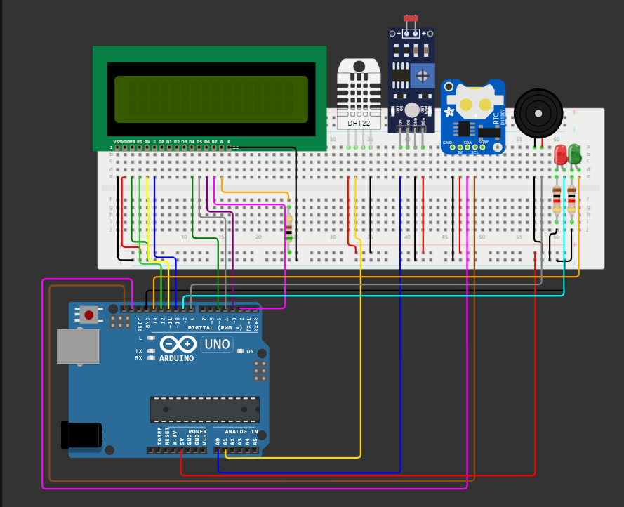

# :house_with_garden:  AMBITECH - SEU AMBIENTE, NOSSA TECNOLOGIA

## 📝 Descrição

Esse projeto tem como objetivo detectar variações de temperatura, umidade e luminosidade do ambiente de acordo com os padrões estabelecidos através de sensores e da plataforma de prototipação Arduino.

## 📚 Funcionalidades

Nosso sistema monitora em tempo real a temperatura, umidade e luminosidade do ambiente que é visualizado através de um display LCD 16x2.

Ele segue regras estabelecidas, na qual, quando uma variável dessas sai do padrão ele emite um aviso sonoro através de um Buzzer e um aviso visual com um LED vermelho e guarda na memória EEPRON do microcontrolador a data,horário e qual variável saiu desse padrão. Quando as variáveis estão nos níveis adequados um LED verde se mantém aceso, mostrando-nos que está tudo operando conforme a regra estabelecida.

## Regra das variáveis

**Níveis adequados:**

Temperatura: **15ºC < T < 25 ºC**

Luminosidade: **0 < L < 30%**

Umidade: **30% < U < 50%**

## 🔧 Ferramentas utilizadas

- 1 MCU (Atmega 328P) - Arduino Uno R3 
- 1 LDR + Resistor 10KOhm
- 1 DHT-11 (Sensor de temperatura e umidade)
- 1 LCD 16x2
- 1 Bateria de 9V
- 1 Suporte para bateria
- 1 RTC (Real Time Clock)
- 1 protoboard
- Jumpers
- LEDs
- Resistores
- Buzzer

## ⚡ Circuito

Obs: No projeto real é utilizado o sensor DHT11 ao invés do sensor DHT22 e ao invés de usar um módulo de sensor de luz, foi utilizado um sensor LDR com um resistor de 10kOhm para fazer a divisão de tensão.

### Pinagem do circuito

| Pinos |              Descrição               | Cor do jumper |
| :---: | :----------------------------------: | :-----------: |
|  13   |        Sinal para o Led verde        |    Laranja    |
|  12   |           RS (Entrada LCD)           |  Verde claro  |
|  11   |           RW (Entrada LCD)           |    Amarelo    |
|  10   |           E (Entrada LCD)            |     Azul      |
|   9   | Sinal de alerta para o Led vermelho  |     Ciano     |
|   8   |    Sinal de alerta para o Buzzer     |     Cinza     |
|   5   |           D4 (Entrada LCD)           | Verde escuro  |
|   4   |           D5 (Entrada LCD)           |     Cinza     |
|   3   |           D6 (Entrada LCD)           |     Roxo      |
|   2   |           D7 (Entrada LCD)           |     Rosa      |
|  A0   |  INPUT - Recebe sinal do sensor LDR  |     Azul      |
|  A1   | INPUT - Recebe sinal do sensor DHT11 |    Amarelo    |
|  SCL  |          SCL do módulo RTC           |    Marrom     |
|  SDA  |          SDA do módulo RTC           |     Rosa      |
|  5V   |      Alimentação da Protoboard       |   Vermelho    |
|  GND  |         Terra da Protoboard          |     Preto     |

## 🚀 Rodando o projeto

Para rodar o repositório é necessário clonar o mesmo, dar o seguinte comando para clonar o projeto:

``git clone https://github.com/guigarciag/AMBITECH``

Após isso, encontre o arquivo **main.ino** dentro da pasta **main** e abra-o com o IDE do seu Arduino. Lembre-se que para funcionar o código, são necessárias a instalação das seguintes bibliotecas:

- DHT
- pitches
- RTCLIB
- Wire
- Liquid Crystal
- EEPROM

As bibliotecas podem ser encontradas no formato **.zip** dentro do diretório **lib** ao baixar o repositório para sua máquina.Caso não estejam, instale-as diretamente por meio da IDE do Arduino ou teste-as, pois podem já estarem instaladas juntamente com a IDE. 
Para fazer sua instalação, verifique o procedimento para a IDE escolhida.

## :heavy_check_mark: Resultados obtidos

Conseguimos alcançar os objetivos do projeto, os sensores, os efeitos sonoros e visuais funcionaram adequadamente, além de salvar a o ultimo alerta na memória EEPRON do microcontrolador.

## :video_camera: Vídeo do projeto

https://www.youtube.com/watch?v=Jso6bTLblRY

## 🤝 Colaboradores

### Beatriz de Sa Silva

#   

### Guilherme Gonçalves Garcia

#   

### Lohan Batista Moreira

#   

### Paulo Henrique dos Santos Tristão

#   

### Rodrigo Puertas Matioli

#   

